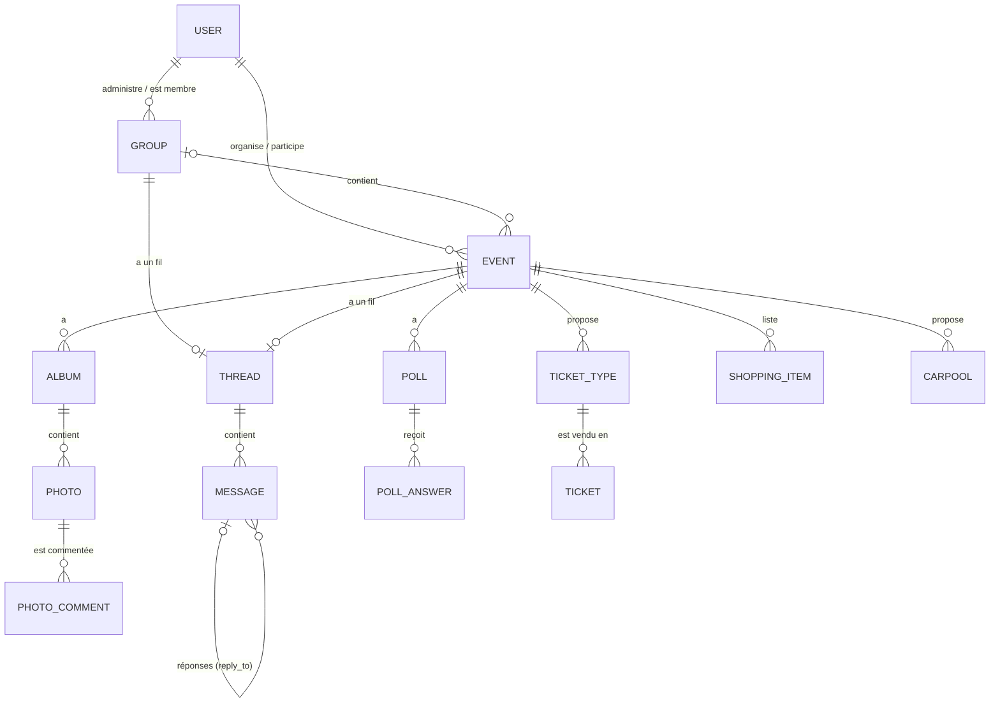

# My Social Networks API

API REST du nouveau service d'événements et de groupes de Facebook, réalisée avec **Node.js**, **Express 5** et **MongoDB** (Mongoose).

Elle couvre tout le cahier des charges : utilisateurs, événements, groupes, fils de discussion, albums photo, sondages et billetterie, ainsi que les deux bonus (shopping list et covoiturage).

- **74 routes**, toutes documentées en OpenAPI 3 (Swagger UI sur `/docs`)
- **14 collections** MongoDB
- **30 tests** de bout en bout (`npm test`)

---

## Sommaire

1. [Installation et lancement](#1-installation-et-lancement)
2. [Documentation de l'API](#2-documentation-de-lapi)
3. [Architecture du projet](#3-architecture-du-projet)
4. [Modèle de données](#4-modèle-de-données)
5. [Droits d'accès](#5-droits-daccès)
6. [Endpoints](#6-endpoints)
7. [Choix et propositions](#7-choix-et-propositions)
8. [Sécurité et validation des entrées](#8-sécurité-et-validation-des-entrées)
9. [Tests](#9-tests)

---

## 1. Installation et lancement

Prérequis : Node.js 22 ou plus récent, et MongoDB en local (`mongodb://127.0.0.1:27017`).

```bash
git clone https://github.com/saadlagz/my-social-networks.git
cd my-social-networks
npm install
npm run dev          # http://localhost:3000, recharge à chaque modification
```

La configuration se trouve dans `src/config.mjs`. Les valeurs sensibles sont lues dans les variables d'environnement (voir `.env.example`, à copier en `.env`) :

| Variable      | Rôle                                        | Défaut en développement                          |
| ------------- | ------------------------------------------- | ------------------------------------------------ |
| `PORT`        | Port HTTP                                   | `3000`                                           |
| `MONGODB_URI` | Lien MongoDB                                | `mongodb://127.0.0.1:27017/my-social-networks`   |
| `JWT_SECRET`  | Clé de signature des tokens                 | une clé de développement                         |
| `PUBLIC_URL`  | URL publique utilisée dans les liens de partage | `http://localhost:3000`                      |

En production (`npm start`), `MONGODB_URI` et `JWT_SECRET` sont obligatoires : sans eux, le serveur refuse de démarrer.

## 2. Documentation de l'API

| Format | Emplacement |
| --- | --- |
| Swagger UI (interactive, avec « Try it out ») | http://localhost:3000/docs |
| Spécification OpenAPI 3 | [`docs/openapi.yaml`](docs/openapi.yaml), également servie en JSON sur `/openapi.json` |
| Collection Postman | [`docs/my-social-networks.postman_collection.json`](docs/my-social-networks.postman_collection.json), à importer dans Postman |

**Authentification** : `POST /auth/register` ou `POST /auth/login` renvoient un `token` JWT (valable 24 h), à envoyer dans le header `Authorization: Bearer <token>`. Dans Swagger UI, cliquez sur **Authorize** et collez le token.

**Format des erreurs** : toutes les erreurs ont la même forme.

```json
{
  "code": 400,
  "message": "Bad Request",
  "errors": ["end_date doit être après start_date", "location est requis"]
}
```

| Code | Signification |
| --- | --- |
| `400` | Données invalides : `errors` liste tous les problèmes, pas seulement le premier |
| `401` | Token absent, invalide ou expiré |
| `403` | Action non autorisée (ex : seul un organisateur peut créer un sondage) |
| `404` | Ressource introuvable, ou invisible pour vous (groupe secret, événement privé) |
| `409` | Conflit : doublon, plus de place, règle métier (ex : dernier administrateur) |
| `429` | Trop de tentatives de connexion |

**Listes paginées** : `?page=1&limit=20` (100 au maximum). Réponse : `{ data: [...], pagination: { page, limit, total, pages } }`.

## 3. Architecture du projet

```
index.mjs                  démarrage + arrêt propre (Ctrl+C)
src/
├── config.mjs             configuration par environnement (development, test, production)
├── server.mjs             Express, connexion MongoDB, documentation, enregistrement des routes
├── controllers/           une classe par ressource, chaque méthode déclare une route
├── models/                schémas Mongoose (1 fichier = 1 collection)
├── validators/            règles de validation des body, par ressource
├── middlewares/
│   ├── auth.mjs           vérification du token JWT → req.user
│   └── errors.mjs         404 et format d'erreur unique { code, message, errors }
└── utils/
    ├── validate.mjs       moteur de validation basé sur la librairie validator
    ├── access.mjs         règles de visibilité et de droits (membre, admin, organisateur...)
    ├── query.mjs          pagination, filtres et recherche
    └── http-error.mjs     erreurs HTTP levées par les contrôleurs
docs/                      OpenAPI + collection Postman
test/                      tests de bout en bout (node:test)
```

Les contrôleurs reprennent la structure vue en cours (`new Controller(app, ...)` puis `run()` qui déclare les routes). Avec Express 5, une erreur levée dans une route `async` est envoyée directement au middleware d'erreurs : chaque route se contente donc de `throw badRequest(...)`, `throw forbidden(...)`, etc., sans `try/catch` à répéter partout.

## 4. Modèle de données



| Collection | Contenu | Contraintes notables |
| --- | --- | --- |
| `users` | prénom, nom, **email unique**, mot de passe (hash bcrypt), avatar, bio, date de naissance | index unique sur `email` (en minuscules) ; le mot de passe n'est jamais renvoyé |
| `groups` | nom, description, icône, photo de couverture, type `public` / `private` / `secret`, `allow_member_posts`, `allow_member_events`, `administrators[]`, `members[]` | au moins 1 administrateur et 1 membre ; les administrateurs font partie des membres |
| `events` | nom, description, dates de début et de fin, lieu, photo de couverture, `visibility` `public` / `private`, `organizers[]`, `participants[]`, `group` (facultatif), `settings` (`ticketing`, `shopping_list`, `carpooling`) | `end_date > start_date` ; au moins 1 organisateur ; billetterie réservée aux événements publics |
| `threads` | `group` **ou** `event` | jamais les deux (validation du schéma) ; 1 fil par groupe et par événement (index uniques partiels) |
| `messages` | fil, auteur, contenu, `reply_to` (message parent) | |
| `albums` | événement, nom, description, créateur | |
| `photos` | album, événement, auteur, URL, légende | |
| `photo_comments` | photo, auteur, contenu | |
| `polls` | événement, titre, `questions[]` → `choices[]` | 1 à 20 questions, 2 à 10 réponses par question |
| `poll_answers` | sondage, participant, `answers[]` (question → choix) | index unique (`poll`, `user`) : une seule participation |
| `ticket_types` | événement, nom, montant, quantité, `sold` | nom unique par événement ; `sold ≤ quantity` |
| `tickets` | événement, type de billet, prix payé, acheteur (nom, prénom, email, adresse complète), date d'achat | index unique (`event`, `buyer.email`) : **1 billet par personne** |
| `shopping_items` | événement, participant, nom, quantité, heure d'arrivée | index unique (`event`, `name_key`) : **chaque article est unique par événement** |
| `carpools` | événement, conducteur, lieu et heure de départ, prix, places, temps maximum d'écart, `passengers[]` | 1 trajet par conducteur et par événement ; `passengers ≤ seats` |

**Pourquoi des collections séparées plutôt que des sous-documents ?** Les messages, photos, commentaires, réponses aux sondages et billets peuvent être très nombreux : les mettre dans le document du groupe ou de l'événement le ferait grossir sans limite (MongoDB limite un document à 16 Mo) et obligerait à tout recharger pour lire une page. Ils ont donc chacun leur collection, indexée et paginée. À l'inverse, les questions d'un sondage sont peu nombreuses et toujours lues ensemble : elles sont des sous-documents de `polls`.

## 5. Droits d'accès

| Ressource | Voir | Créer / écrire | Modifier / supprimer |
| --- | --- | --- | --- |
| Groupe public | tout le monde (même sans compte) | rejoindre : tout utilisateur | administrateurs |
| Groupe privé | nom et description : tout le monde ; membres, fil, événements : membres | rejoindre : sur ajout d'un administrateur | administrateurs |
| Groupe secret | membres uniquement (`404` pour les autres) | sur ajout d'un administrateur | administrateurs |
| Événement public | tout le monde (même sans compte) | participer : tout utilisateur | organisateurs |
| Événement privé | participants uniquement (`404` pour les autres) | ajout par un organisateur | organisateurs |
| Événement dans un groupe | public : comme son groupe (un événement d'un groupe privé ou secret n'est visible que par les membres du groupe et ses participants) | membres du groupe ; administrateurs seulement si `allow_member_events` est à `false` | organisateurs |
| Fil d'un groupe | membres (tout le monde si le groupe est public) | membres ; seuls les administrateurs publient si `allow_member_posts` est à `false`, mais **tous les membres peuvent répondre** | auteur ; suppression aussi par un administrateur |
| Fil d'un événement | participants | participants | auteur ; suppression aussi par un organisateur |
| Albums, photos, commentaires | qui voit l'événement | participants | auteur ou organisateur |
| Sondages | participants | créer : organisateurs ; répondre : participants | organisateurs |
| Billetterie | types de billets : tout le monde, sans compte | types : organisateurs ; achat : **tout le monde, sans compte** | organisateurs |
| Shopping list, covoiturage | participants | participants | auteur ou conducteur ; suppression aussi par un organisateur |

## 6. Endpoints

Le détail (body, réponses, exemples) est dans Swagger UI. Légende : 🌐 sans compte, 🔒 token requis.

<details>
<summary><b>Auth et utilisateurs</b> (7 routes)</summary>

| Méthode | Route | Description |
| --- | --- | --- |
| POST | `/auth/register` 🌐 | Créer un compte (renvoie un token) |
| POST | `/auth/login` 🌐 | Se connecter |
| GET | `/auth/me` 🔒 | Mon profil |
| GET | `/users?search=` 🔒 | Rechercher des utilisateurs (nom, prénom, ou email exact) |
| GET | `/users/:id` 🔒 | Profil public |
| PATCH | `/users/me` 🔒 | Modifier mon profil (`current_password` requis pour changer de mot de passe) |
| DELETE | `/users/me` 🔒 | Supprimer mon compte |
</details>

<details>
<summary><b>Groupes</b> (12 routes)</summary>

| Méthode | Route | Description |
| --- | --- | --- |
| POST | `/groups` 🔒 | Créer un groupe (+ son fil de discussion) |
| GET | `/groups?search=&type=&mine=` 🌐 | Lister les groupes visibles |
| GET | `/groups/:id` 🌐 | Détail |
| PATCH | `/groups/:id` 🔒 | Modifier les paramètres (admin) |
| DELETE | `/groups/:id` 🔒 | Supprimer (admin) |
| GET | `/groups/:id/members` 🌐 | Membres et rôles |
| POST | `/groups/:id/members` 🔒 | Ajouter des membres ou administrateurs (admin) |
| POST | `/groups/:id/join` 🔒 | Rejoindre un groupe public |
| PATCH | `/groups/:id/members/:userId` 🔒 | Changer le rôle (admin) |
| DELETE | `/groups/:id/members/:userId` 🔒 | Quitter / retirer un membre |
| GET | `/groups/:id/events` 🌐 | Événements du groupe |
| GET | `/groups/:id/thread` 🔒 | Fil de discussion du groupe |
</details>

<details>
<summary><b>Événements</b> (13 routes)</summary>

| Méthode | Route | Description |
| --- | --- | --- |
| POST | `/events` 🔒 | Créer un événement (infos, organisateurs, membres, groupe, `invite_group_members`) |
| GET | `/events?search=&from=&to=&group=&mine=` 🌐 | Lister les événements visibles |
| GET | `/events/:id` 🌐 | Détail |
| PATCH | `/events/:id` 🔒 | Modifier (organisateur) |
| DELETE | `/events/:id` 🔒 | Supprimer avec toutes ses données (organisateur) |
| GET | `/events/:id/participants` 🌐 | Participants et rôles |
| POST | `/events/:id/participants` 🔒 | Ajouter des participants ou organisateurs (organisateur) |
| POST | `/events/:id/join` 🔒 | Participer à un événement public |
| POST | `/events/:id/invite-group` 🔒 | Inviter tous les membres du groupe en un clic (organisateur) |
| PATCH | `/events/:id/participants/:userId` 🔒 | Changer le rôle (organisateur) |
| DELETE | `/events/:id/participants/:userId` 🔒 | Se désinscrire / retirer un participant |
| GET | `/events/:id/share` 🔒 | Liens de partage Facebook, X, LinkedIn, WhatsApp, email (organisateur) |
| GET | `/events/:id/thread` 🔒 | Fil de discussion de l'événement |
</details>

<details>
<summary><b>Fils de discussion</b> (5 routes)</summary>

| Méthode | Route | Description |
| --- | --- | --- |
| GET | `/threads/:id` 🔒 | Détail du fil (groupe ou événement, nombre de messages) |
| GET | `/threads/:id/messages?reply_to=` 🔒 | Messages, ou réponses à un message |
| POST | `/threads/:id/messages` 🔒 | Publier, ou répondre avec `reply_to` |
| PATCH | `/threads/:id/messages/:messageId` 🔒 | Modifier son message |
| DELETE | `/threads/:id/messages/:messageId` 🔒 | Supprimer un message et ses réponses |
</details>

<details>
<summary><b>Albums photo</b> (13 routes)</summary>

| Méthode | Route | Description |
| --- | --- | --- |
| POST | `/events/:id/albums` 🔒 | Créer un album |
| GET | `/events/:id/albums` 🔒 | Albums de l'événement |
| GET / PATCH / DELETE | `/albums/:id` 🔒 | Détail, modification, suppression |
| POST | `/albums/:id/photos` 🔒 | Poster une photo |
| GET | `/albums/:id/photos` 🔒 | Photos de l'album |
| GET / PATCH / DELETE | `/photos/:id` 🔒 | Détail, légende, suppression |
| GET | `/photos/:id/comments` 🔒 | Commentaires |
| POST | `/photos/:id/comments` 🔒 | Commenter |
| DELETE | `/photos/:id/comments/:commentId` 🔒 | Supprimer un commentaire |
</details>

<details>
<summary><b>Sondages</b> (6 routes)</summary>

| Méthode | Route | Description |
| --- | --- | --- |
| POST | `/events/:id/polls` 🔒 | Créer un sondage (organisateur) |
| GET | `/events/:id/polls` 🔒 | Sondages (avec `answered`) |
| GET | `/polls/:id` 🔒 | Détail (avec `my_answers`) |
| DELETE | `/polls/:id` 🔒 | Supprimer (organisateur) |
| POST | `/polls/:id/answers` 🔒 | Répondre : une réponse par question |
| GET | `/polls/:id/results` 🔒 | Résultats (votes par réponse) |
</details>

<details>
<summary><b>Billetterie</b> (7 routes)</summary>

| Méthode | Route | Description |
| --- | --- | --- |
| POST | `/events/:id/ticket-types` 🔒 | Créer un type de billet (organisateur) |
| GET | `/events/:id/ticket-types` 🌐 | Types de billets et places restantes |
| PATCH | `/ticket-types/:id` 🔒 | Modifier (organisateur) |
| DELETE | `/ticket-types/:id` 🔒 | Supprimer si aucun billet vendu (organisateur) |
| POST | `/ticket-types/:id/tickets` 🌐 | **Acheter un billet, sans compte** |
| GET | `/events/:id/tickets` 🔒 | Billets vendus (organisateur) |
| DELETE | `/tickets/:id` 🔒 | Annuler un billet, la place est remise en vente (organisateur) |
</details>

<details>
<summary><b>Bonus : shopping list et covoiturage</b> (11 routes)</summary>

| Méthode | Route | Description |
| --- | --- | --- |
| GET | `/events/:id/shopping-items` 🔒 | Ce que chacun apporte |
| POST | `/events/:id/shopping-items` 🔒 | Indiquer ce que j'apporte |
| PATCH / DELETE | `/shopping-items/:id` 🔒 | Modifier / supprimer |
| GET | `/events/:id/carpools` 🔒 | Trajets proposés |
| POST | `/events/:id/carpools` 🔒 | Proposer un trajet |
| GET / PATCH / DELETE | `/carpools/:id` 🔒 | Détail / modifier / supprimer |
| POST | `/carpools/:id/passengers` 🔒 | Réserver une place |
| DELETE | `/carpools/:id/passengers/:userId` 🔒 | Annuler une réservation |
</details>

### Exemple de parcours

```bash
# 1. créer un compte et récupérer le token
TOKEN=$(curl -s -X POST localhost:3000/auth/register -H 'Content-Type: application/json' \
  -d '{"firstname":"Saad","lastname":"Lagzouli","email":"saad@exemple.fr","password":"motdepasse1"}' \
  | node -pe 'JSON.parse(require("fs").readFileSync(0)).token')

# 2. créer un événement public avec billetterie et covoiturage
curl -X POST localhost:3000/events -H "Authorization: Bearer $TOKEN" -H 'Content-Type: application/json' -d '{
  "name": "Soirée d'\''intégration",
  "start_date": "2026-11-14T19:00:00Z",
  "end_date": "2026-11-15T02:00:00Z",
  "location": "Villejuif",
  "settings": { "ticketing": true, "carpooling": true }
}'
```

## 7. Choix et propositions

Le cahier des charges laisse plusieurs points ouverts. Voici les choix faits, toujours dans l'esprit de la demande de Facebook :

- **Authentification JWT.** La spec parle d'organisateurs, d'administrateurs et de membres : il faut savoir qui fait la requête. L'API utilise des tokens JWT, avec mots de passe hachés (bcrypt) et un rate limit sur la connexion.
- **Les organisateurs sont aussi des participants**, et **les administrateurs sont aussi des membres**. Cela simplifie les règles (« un participant peut poster une photo » inclut les organisateurs). Un événement garde toujours au moins un organisateur, un groupe au moins un administrateur (`409` sinon).
- **Création d'un événement « en une étape »** : `POST /events` reçoit les informations essentielles, les organisateurs et les membres. Dans un groupe, `invite_group_members: true` (à la création) ou `POST /events/:id/invite-group` (après) invitent tous les membres en un clic.
- **Groupe secret / événement privé = `404`** pour les non-membres : leur existence même n'est pas révélée. Un groupe privé reste trouvable (nom, description) mais son contenu est réservé aux membres (`403`). Un événement « public » créé dans un groupe privé ou secret n'est visible que par les membres du groupe : sinon il ferait fuiter le contenu du groupe.
- **`allow_member_posts: false`** empêche les membres de lancer de nouveaux messages, mais pas de répondre : la spec dit explicitement que « chaque membre peut répondre à un message ».
- **Partage sur les réseaux sociaux** : `GET /events/:id/share` génère les liens (Facebook, X, LinkedIn, WhatsApp, email), uniquement pour un événement public, hors groupe ou dans un groupe public.
- **Billetterie** : ouverte aux **personnes extérieures sans compte** (c'est l'intention de « personne extérieure »). La personne est identifiée par son email : un index unique garantit **un seul billet par personne et par événement**. La place est réservée de façon **atomique** (`findOneAndUpdate` avec condition `sold < quantity`) : deux achats simultanés ne peuvent pas dépasser la quantité. Le prix payé est copié dans le billet, au cas où l'organisateur change le prix ensuite. On ne peut plus désactiver la billetterie, supprimer un type de billet vendu ni baisser sa quantité sous le nombre de billets vendus.
- **Sondages** : chaque question et chaque réponse possible a un `_id`. Le participant envoie un couple `{ question, choice }` par question ; l'API vérifie qu'il répond à toutes les questions, une seule fois chacune, avec un choix qui appartient bien à la question. Les résultats sont calculés par une agrégation MongoDB.
- **Shopping list** : l'unicité ignore les majuscules, les accents et les espaces (« Chips » = « chips  » = « CHIPS »), grâce à un champ normalisé indexé. L'heure d'arrivée doit être avant la fin de l'événement.
- **Covoiturage** : en plus de la proposition de trajet demandée, les participants peuvent **réserver une place** (réservation atomique, comme pour les billets).
- **Fonctionnalités activables** : billetterie, shopping list et covoiturage sont désactivés par défaut et s'activent dans `settings` (« si la shopping list est activée »...). Toutes les routes concernées répondent `409` tant que l'option est désactivée.
- **Suppressions en cascade** : supprimer un événement supprime son fil, ses messages, albums, photos, commentaires, sondages, réponses, billets, shopping list et covoiturages. Quitter un événement libère sa place en covoiturage. Supprimer un groupe garde ses événements (sans groupe).
- **Vie privée** : l'email d'un utilisateur n'est jamais renvoyé aux autres (seulement `firstname`, `lastname`, `avatar`, `bio`).
- **Photos par URL** : l'API stocke des liens (`https://...`) plutôt que des fichiers. L'envoi de fichiers passerait par un service de stockage (S3, Cloudinary...) qui renverrait ces URL.

## 8. Sécurité et validation des entrées

La validation se fait **à deux niveaux** :

1. **Validators d'entrée** (`src/validators/*.mjs`, moteur `src/utils/validate.mjs` basé sur la librairie `validator`) : chaque body est vérifié champ par champ avant tout accès à la base (types, longueurs, emails, URL `http(s)`, dates ISO 8601, montants à 2 décimales, codes postaux, identifiants MongoDB, énumérations). Toutes les erreurs sont renvoyées en une fois.
2. **Schémas Mongoose** (`src/models/*.mjs`) : `required`, `enum`, `min`/`max`, validations personnalisées (`end_date > start_date`, fil lié à un groupe XOR un événement...) et index uniques. C'est le filet de sécurité si une donnée invalide passait le premier niveau, ou si deux requêtes arrivaient en même temps.

Autres protections :

- **Liste blanche des champs** : seuls les champs prévus sont gardés. Envoyer `"organizers"` dans un `PATCH /events/:id`, ou `"role": "admin"` dans un `PATCH /users/me`, n'a aucun effet (pas d'assignation de masse).
- **Injection NoSQL** : les valeurs sont vérifiées par type (une chaîne attendue ne peut pas être un objet `{"$gt": ""}`), et les recherches textuelles sont échappées avant d'être utilisées dans une regex.
- **Mots de passe** hachés avec bcrypt (jamais renvoyés), changement de mot de passe protégé par l'ancien, messages d'erreur de connexion identiques que l'email existe ou non.
- **Rate limit** sur `/auth/login` (20 tentatives / 15 min / IP), body limité à 100 ko, header `X-Powered-By` désactivé, secrets lus dans l'environnement.

## 9. Tests

```bash
npm test
```

Les tests (`test/api.test.mjs`) démarrent la vraie API sur une base dédiée (`my-social-networks-test`, vidée à chaque lancement) et déroulent un scénario complet : inscription, groupes et visibilité, fils de discussion, événements privés et de groupe, albums, sondages, billetterie (quantité limitée, un billet par personne), shopping list, covoiturage et suppressions en cascade. Un second test (`test/zz-docs.test.mjs`) vérifie que **chaque route déclarée dans le code est documentée** dans `docs/openapi.yaml`.

```
▶ utilisateurs et authentification
▶ groupes
▶ événements
▶ sécurité : événements des groupes privés ou secrets
▶ albums photo
▶ sondages
▶ billetterie
▶ shopping list (bonus)
▶ covoiturage (bonus)
▶ suppressions en cascade
ℹ tests 30
ℹ pass 30
ℹ fail 0
```

---

Saad Lagzouli · EFREI · Module API
